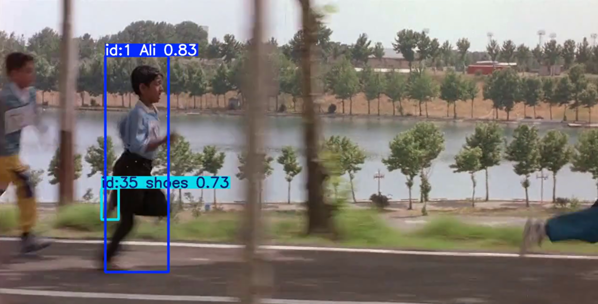
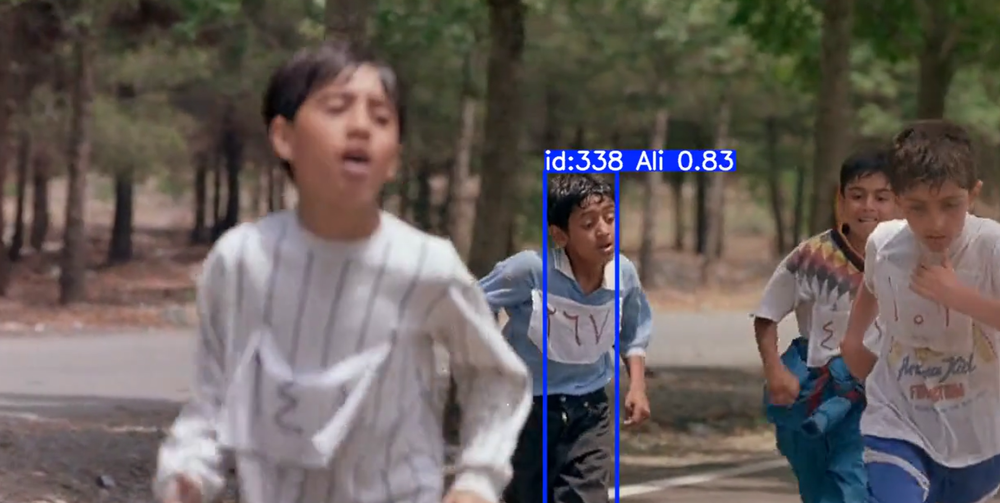

# Runner Detection and Tracking with YOLOv8 & ByteTrack

An end-to-end computer vision project for **object detection and multi-object tracking** in a running race scene using **YOLOv8** and **ByteTrack**.

The project covers the complete pipeline from video frame extraction and dataset preparation to model training, evaluation, detection, and tracking across consecutive video frames.

---

## Project Overview

The objective of this project is to develop a computer vision pipeline for detecting and tracking targets in a crowded running race scene extracted from the Iranian film *Children of Heaven*.

Frames were extracted from the source video and used to construct a custom object detection dataset.

A **YOLOv8** model was fine-tuned on the custom dataset for object detection. The trained detector was then integrated with **ByteTrack** to perform multi-object tracking and maintain object identities across consecutive video frames.

---

## Pipeline

```text
Source Video
    ↓
Frame Extraction
    ↓
Dataset Preparation & Annotation
    ↓
YOLOv8 Training
    ↓
Model Evaluation
    ↓
Object Detection
    ↓
ByteTrack Multi-Object Tracking
    ↓
Tracked Output Video
```

---

## Technologies

- Python
- YOLOv8
- Ultralytics
- OpenCV
- ByteTrack
- Roboflow
- Google Colab
- Computer Vision
- Object Detection
- Multi-Object Tracking

---

## Dataset Preparation

The dataset was created by extracting individual frames from the source video.

The included `extract_frames.py` script can be used to convert a video into individual image frames:

```bash
python extract_frames.py --video path/to/video.mp4 --output data/frames
```

The extracted frames can then be annotated and converted into YOLO-compatible format for model training.

> **Note:** The original movie footage and full dataset are not distributed in this repository.

---

## Model Training

The object detection model was trained using **YOLOv8s** from the Ultralytics framework.

The main training configuration used in the experiment was:

| Parameter | Value |
|---|---|
| Model | YOLOv8s |
| Epochs | 80 |
| Batch Size | 16 |
| Image Size | 768 |
| Patience | 25 |
| Learning Rate Schedule | Cosine |
| Framework | Ultralytics YOLOv8 |

The complete training workflow is available in:

`runner_detection_tracking.ipynb`

---

## Multi-Object Tracking

After training the YOLOv8 detector, **ByteTrack** was used to associate detections across consecutive frames.

The main tracking configuration was:

| Parameter | Value |
|---|---|
| Tracker | ByteTrack |
| Confidence Threshold | 0.63 |
| IoU Threshold | 0.50 |
| Image Size | 768 |

The tracking stage assigns persistent IDs to detected objects, enabling their movement to be followed throughout the video sequence.

---

## Results

The following examples demonstrate the output of the YOLOv8 + ByteTrack pipeline.

The visualizations include **bounding boxes, tracking IDs, class labels, and confidence scores** generated during inference.

### Sample Tracking Result 1

<p align="center">
  
</p>

### Sample Tracking Result 2

<p align="center">
  
</p>

These examples illustrate object detection and identity tracking under changing viewpoints, motion, and crowded race conditions.

---

## Repository Structure

```text
runner-detection-tracking-yolov8/
│
├── assets/
│   ├── result_1.png
│   └── result_2.png
│
├── extract_frames.py
├── runner_detection_tracking.ipynb
├── requirements.txt
└── README.md
```

---

## Installation

Install the required Python packages using:

```bash
pip install -r requirements.txt
```

Main dependencies include:

- `ultralytics`
- `opencv-python`
- `roboflow`

---

## Usage

### 1. Extract frames from a video

```bash
python extract_frames.py --video path/to/video.mp4 --output data/frames
```

### 2. Prepare and annotate the dataset

Annotate the extracted frames and export the dataset in YOLO format.

### 3. Train the YOLOv8 model

The complete training pipeline and configuration are provided in:

```text
runner_detection_tracking.ipynb
```

### 4. Run multi-object tracking

The trained YOLOv8 detector is combined with ByteTrack to track detected objects across video frames.

---

## Limitations

The current model was developed using a custom dataset extracted from a specific race scene. Performance may therefore vary when applied to different environments, camera viewpoints, lighting conditions, or significantly different types of running scenes.

Occlusion and rapid motion can also affect both detection and tracking performance.

---

## Future Improvements

Future extensions of this project may include:

- Evaluation on additional race and crowd scenes
- Expansion of the training dataset
- Comparison of different YOLO model variants
- Evaluation using standard object detection metrics
- Evaluation using multi-object tracking metrics
- Improved handling of occlusion
- Comparison of ByteTrack with alternative tracking algorithms
- Real-time inference optimization

---

## Author

**Faezeh Foroughi**

M.Sc. Student in Data Science  
Isfahan University of Technology

Research interests include **Artificial Intelligence, Machine Learning, Deep Learning, Graph Neural Networks, Recommender Systems, Data Mining, and intelligent data-driven systems**.

---

## Disclaimer

This repository is intended for **educational and research purposes**.

The original movie footage is not distributed as part of this repository.
